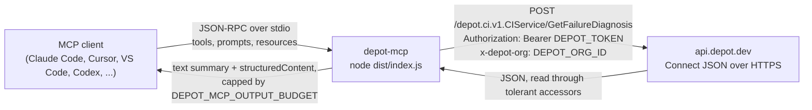

# depot-mcp: MCP server for Depot (depot.dev)

A read-only [Model Context Protocol](https://modelcontextprotocol.io) server for **[Depot](https://depot.dev), the container build and CI acceleration service**. It gives a coding agent Depot's own answer to "why did CI fail?" and "why did this build fail?", plus the run history, cache effectiveness, registry contents, CI configuration, and usage data behind those answers.

[](https://github.com/akshayjain3450/depot-mcp/actions/workflows/ci.yml)
[](https://www.npmjs.com/package/depot-mcp)
[](https://registry.modelcontextprotocol.io/v0/servers?search=io.github.akshayjain3450/depot-mcp)
[](./LICENSE)
[](./.nvmrc)

**Community project. Not affiliated with, endorsed by, or supported by Depot.** Source-available under Apache 2.0 with the Commons Clause; see [License](#license).

**Not to be confused with:** The Home Depot, Chromium's `depot_tools`, Steam depots, Perforce depots, or any other "depot". This server talks only to `api.depot.dev`.

## Contents

- [Why this exists](#why-this-exists)
- [Status](#status)
- [Prerequisites](#prerequisites)
  - [Which token can do what](#which-token-can-do-what)
- [Installation](#installation)
- [Compatibility](#compatibility)
- [Where to find it](#where-to-find-it)
- [Configuration](#configuration)
- [Tools](#tools)
- [Read-only model and security](#read-only-model-and-security)
- [Limitations](#limitations)
- [Architecture](#architecture)
- [Troubleshooting](#troubleshooting)
- [Development](#development)
- [Contributing](#contributing)
- [Roadmap](./docs/roadmap.md)
- [License](#license)

## Why this exists

Depot ships a good agent story already, but it is not MCP. Depot's answer is [Agent Skills](https://github.com/depot/skills): `SKILL.md` files that teach an agent to drive the `depot` CLI, plus a documented CI API and `llms.txt`. Depot's own post announcing Skills notes two limitations: skills work best in clients that implement the `SKILL.md` convention, and they are "sometimes notorious for not being automatically used by agents."

This server covers the gaps that leaves:

- **Agents without a shell.** Skills require a logged-in `depot` binary on the machine. A tool call does not.
- **Clients that don't read `SKILL.md`.** MCP is client-agnostic.
- **Reliable invocation.** A registered tool with a description is discovered through the protocol rather than hopefully retrieved.
- **A read-only boundary.** A skill cannot stop an agent from running `depot ci rerun`. This server can, and does; see [Read-only model and security](#read-only-model-and-security).

The flagship tool is a thin, careful wrapper around something Depot already built: `GetFailureDiagnosis`, a server-side failure analysis that clusters a run's failures by root cause and returns a diagnosis, a suggested fix, and the evidence lines, already bounded so it fits in a context window. Most of this server's value is exposing that well.

### How it compares to Depot Agent Skills

| | Depot Agent Skills | depot-mcp |
| --- | --- | --- |
| Needs the `depot` CLI installed and logged in | yes | no |
| Works in clients without `SKILL.md` support | no | yes |
| Invocation | agent must retrieve the skill | tool is listed in `tools/list` |
| Can mutate Depot (rerun, cancel, reset) | yes, anything the CLI can | off by default; five CI write tools behind `DEPOT_MCP_ALLOW_WRITES`, each dry-run first |
| Can mutate Depot (rerun, cancel, reset) | yes, anything the CLI can | three opt-in write tools behind `DEPOT_MCP_ALLOW_WRITES`, dry-run by default; no rerun, cancel, or reset |
| Output bounded for a context window | depends on the CLI command | every tool |
| Maintained by | Depot | community |

As of 2026-09-05 no standalone Depot MCP server exists (first-party or otherwise, in the official registry, on npm, or on PyPI), and Depot's own guidance for agents without a shell is to call the CI API directly. This server is that API call, shaped for an agent.

## Status

- **Read-only by default.** With `DEPOT_MCP_ALLOW_WRITES` unset, no tool that can change anything is registered. Setting it adds five Depot CI write tools (cancel run or workflow, cancel job, retry failed jobs, retry one job, rerun workflow), every one of which dry-runs first; see [Write tools](#write-tools-opt-in). There is still no dispatch, delete, secret, or token-minting tool.
- **Read-only by default.** Without `DEPOT_MCP_ALLOW_WRITES` no registered tool can change anything. With it, three write tools appear (set or delete a CI variable, create a project), each previewing by default and refusing unsafe requests before any write. There is still no retry, cancel, rerun, dispatch, or token-minting tool.
- **Depot CI is beta**, per Depot's own documentation. The CI tools are the most valuable ones here and also the most likely to shift under you.
- **Four beta tools are opt-in.** `DEPOT_MCP_ENABLE_BETA=1` adds read-only tools for Depot sandboxes (`depot.sandbox.v1`) and the Depot registry (`depot.registry.v1beta1`). Those APIs are published only as protos, one of them beta in its name, so the tools stay hidden unless you ask for them; see [Beta](#beta-opt-in).
- **Verified against a real Depot organization on 2026-09-06.** Every tool was run live with both token kinds, and `depot_diagnose_build` against a real failed build. The one tool not yet exercised against real data is `depot_diagnose_ci_failure`, because the test organization had no Depot CI runs; its request shape was verified against Depot (an unknown id returns Depot's own `not_found`), and its response parsing is covered by fixtures taken from Depot's CLI documentation.
- **MCP protocol revision `2025-11-25`.** This server is built on the `@modelcontextprotocol/sdk` 1.x line, which speaks `2025-11-25`. The current spec revision is `2026-07-28`, implemented by the v2 packages (`@modelcontextprotocol/server` 2.0.0, published 2026-07-28), which also serve `2025-11-25` clients. Every current client negotiates `2025-11-25`, so nothing is lost today. Moving to v2 is a planned, contained change: the SDK is imported in nine files and the transport wiring lives in `src/index.ts`.

## Prerequisites

- **Node.js 20 or newer** (`node --version`). The Docker image needs no Node on the host.
- **A Depot Organization token.** Depot dashboard, Organization Settings, API Tokens. A user token from `depot login` also works but spans every organization you belong to, so set `DEPOT_ORG_ID` too.
- **Project tokens will not work.** Depot's own scope matrix excludes them from Depot CI and the API entirely.

### Which token can do what

Depot has three kinds of token and they are not interchangeable. Verified live on 2026-09-06, including with a user token belonging to an organization owner:

| Tool group | Organization token | User token |
| --- | --- | --- |
| `depot_whoami` | yes | yes |
| Depot CI: `depot_diagnose_ci_failure`, `depot_list_ci_runs`, `depot_get_ci_run`, `depot_get_ci_job`, `depot_get_ci_attempt`, `depot_list_ci_workflows`, `depot_get_ci_workflow`, `depot_get_ci_logs`, `depot_get_ci_job_summary`, `depot_get_ci_metrics`, `depot_list_ci_artifacts` | yes | yes |
| Depot CI: `depot_diagnose_ci_failure`, `depot_list_ci_runs`, `depot_get_ci_run`, `depot_wait_for_ci_run`, `depot_get_ci_logs`, `depot_get_ci_job_summary`, `depot_get_ci_metrics`, `depot_list_ci_artifacts`, `depot_get_ci_artifact_url` | yes | yes |
| Depot CI: `depot_diagnose_ci_failure`, `depot_list_ci_runs`, `depot_get_ci_run`, `depot_get_ci_logs`, `depot_get_ci_job_summary`, `depot_get_ci_metrics`, `depot_list_ci_artifacts`, `depot_compare_ci_runs` | yes | yes |
| `depot_list_ci_secrets`, `depot_list_ci_variables` | yes | admins and owners only |
| `depot_list_images` | yes | yes |
| `depot_list_projects`, `depot_get_project`, `depot_list_builds`, `depot_get_build`, `depot_diagnose_build`, `depot_get_usage` | yes | **no**: Depot answers `401 Invalid token`, whatever the user's role |
| `depot_list_projects`, `depot_get_project`, `depot_audit_trust_policies`, `depot_list_project_tokens`, `depot_list_builds`, `depot_diagnose_build`, `depot_get_usage`, `depot_list_project_usage`, `depot_get_cache_summary` | yes | **no**: Depot answers `401 Invalid token`, whatever the user's role |
| `depot_list_projects`, `depot_get_project`, `depot_list_builds`, `depot_diagnose_build`, `depot_get_usage` | yes | **no**: Depot answers `401 Invalid token`, whatever the user's role |
| Beta: `depot_list_sandboxes`, `depot_get_sandbox`, `depot_list_registry_repositories`, `depot_get_registry_image` | yes | not tested yet |
| Project token | runs nothing | |

The full matrix, per tool and per Depot service, with how to obtain each token, is in [docs/tokens.md](./docs/tokens.md). `depot_whoami` reports which kind it holds and names the tools that will not work.

Create a dedicated token for this server so you can revoke it independently. Depot has no read-only token scope; read [the security section](#read-only-model-and-security) before you paste one anywhere.

## Installation

Every client below runs the same command over stdio. The only things that vary are the file the config lives in and how that client lets you keep the token out of the file.

The generic config, which works as-is in Claude Desktop, Cursor, Windsurf, Cline, JetBrains, and most other clients:

```json
{
  "mcpServers": {
    "depot": {
      "command": "npx",
      "args": ["-y", "depot-mcp"],
      "env": {
        "DEPOT_TOKEN": "YOUR_DEPOT_TOKEN"
      }
    }
  }
}
```

Add `"DEPOT_ORG_ID": "..."` to `env` if your token can see more than one organization. Every tool is prefixed `depot_`, and tool names are stable across releases.

### Claude Code

```bash
claude mcp add depot --scope user --env DEPOT_TOKEN=YOUR_DEPOT_TOKEN -- npx -y depot-mcp
```

Or commit a `.mcp.json` at the repository root so the whole team gets it. Claude Code expands `${VAR}` and `${VAR:-default}` in `command`, `args`, `env`, `url`, and `headers`, so the token stays in each developer's shell environment and out of git. Copy [`.mcp.json.example`](./.mcp.json.example):

```json
{
  "mcpServers": {
    "depot": {
      "type": "stdio",
      "command": "npx",
      "args": ["-y", "depot-mcp"],
      "env": {
        "DEPOT_TOKEN": "${DEPOT_TOKEN}",
        "DEPOT_ORG_ID": "${DEPOT_ORG_ID:-}"
      }
    }
  }
}
```

Claude Code prompts on every MCP tool call regardless of `readOnlyHint`. To stop being asked, allow the read-only tools in `.claude/settings.json`: `"permissions": { "allow": ["mcp__depot__*"] }`.

### Claude Desktop

Two options.

**Extension bundle (one click).** Download `depot-mcp.mcpb` from the [releases page](https://github.com/akshayjain3450/depot-mcp/releases), open it with Claude Desktop (or Settings, Extensions, Advanced settings, Install extension), and paste the token into the settings form. The token field is marked sensitive in [`manifest.json`](./manifest.json), so Claude Desktop stores it in the OS keychain rather than in a JSON file.

**Manual JSON.** Edit `~/Library/Application Support/Claude/claude_desktop_config.json` on macOS or `%APPDATA%\Claude\claude_desktop_config.json` on Windows and add the generic config above.

### Cursor

[](https://cursor.com/en/install-mcp?name=depot&config=eyJjb21tYW5kIjoibnB4IiwiYXJncyI6WyIteSIsImRlcG90LW1jcCJdLCJlbnYiOnsiREVQT1RfVE9LRU4iOiIifX0%3D)

The button pre-fills the server; fill in `DEPOT_TOKEN` when Cursor shows the config. Or edit `~/.cursor/mcp.json` (all projects) or `.cursor/mcp.json` (one project). Cursor resolves `${env:NAME}` in `command`, `args`, `env`, `url`, and `headers`, so a committed project file can read the token from the environment:

```json
{
  "mcpServers": {
    "depot": {
      "command": "npx",
      "args": ["-y", "depot-mcp"],
      "env": {
        "DEPOT_TOKEN": "${env:DEPOT_TOKEN}"
      }
    }
  }
}
```

### VS Code and GitHub Copilot

[](https://insiders.vscode.dev/redirect?url=vscode%3Amcp%2Finstall%3F%257B%2522name%2522%253A%2522depot%2522%252C%2522command%2522%253A%2522npx%2522%252C%2522args%2522%253A%255B%2522-y%2522%252C%2522depot-mcp%2522%255D%252C%2522env%2522%253A%257B%2522DEPOT_TOKEN%2522%253A%2522%2524%257Binput%253Adepot-token%257D%2522%257D%252C%2522inputs%2522%253A%255B%257B%2522type%2522%253A%2522promptString%2522%252C%2522id%2522%253A%2522depot-token%2522%252C%2522description%2522%253A%2522Depot%2520Organization%2520token%2522%252C%2522password%2522%253Atrue%257D%255D%257D)
[](https://insiders.vscode.dev/redirect?url=vscode-insiders%3Amcp%2Finstall%3F%257B%2522name%2522%253A%2522depot%2522%252C%2522command%2522%253A%2522npx%2522%252C%2522args%2522%253A%255B%2522-y%2522%252C%2522depot-mcp%2522%255D%252C%2522env%2522%253A%257B%2522DEPOT_TOKEN%2522%253A%2522%2524%257Binput%253Adepot-token%257D%2522%257D%252C%2522inputs%2522%253A%255B%257B%2522type%2522%253A%2522promptString%2522%252C%2522id%2522%253A%2522depot-token%2522%252C%2522description%2522%253A%2522Depot%2520Organization%2520token%2522%252C%2522password%2522%253Atrue%257D%255D%257D)

The buttons register the server and prompt for the token once, storing it as a VS Code secret. Equivalent `.vscode/mcp.json` (safe to commit: the token is an input, not a value):

```json
{
  "inputs": [
    {
      "type": "promptString",
      "id": "depot-token",
      "description": "Depot Organization token",
      "password": true
    }
  ],
  "servers": {
    "depot": {
      "type": "stdio",
      "command": "npx",
      "args": ["-y", "depot-mcp"],
      "env": {
        "DEPOT_TOKEN": "${input:depot-token}"
      }
    }
  }
}
```

Or from a terminal: `code --add-mcp '{"name":"depot","command":"npx","args":["-y","depot-mcp"],"env":{"DEPOT_TOKEN":"YOUR_DEPOT_TOKEN"}}'`. Copilot Chat in VS Code uses whatever is in `mcp.json`; use "MCP: Open User Configuration" for a user-level file.

### GitHub Copilot coding agent

Repository Settings, Copilot, Coding agent, MCP configuration. Secrets must be Copilot environment secrets whose names start with `COPILOT_MCP_`:

```json
{
  "mcpServers": {
    "depot": {
      "type": "local",
      "command": "npx",
      "args": ["-y", "depot-mcp"],
      "env": {
        "DEPOT_TOKEN": "$COPILOT_MCP_DEPOT_TOKEN"
      },
      "tools": ["*"]
    }
  }
}
```

### OpenAI Codex CLI

```bash
codex mcp add depot --env DEPOT_TOKEN=YOUR_DEPOT_TOKEN -- npx -y depot-mcp
```

Or in `~/.codex/config.toml`. `env_vars` forwards named variables from your shell so the token need not be written into the file:

```toml
[mcp_servers.depot]
command = "npx"
args = ["-y", "depot-mcp"]
env_vars = ["DEPOT_TOKEN", "DEPOT_ORG_ID"]
```

### Gemini CLI

```bash
gemini mcp add -e DEPOT_TOKEN=YOUR_DEPOT_TOKEN depot npx -y depot-mcp
```

Or in `~/.gemini/settings.json`. Gemini CLI expands `$VAR` and `${VAR}` inside `env`:

```json
{
  "mcpServers": {
    "depot": {
      "command": "npx",
      "args": ["-y", "depot-mcp"],
      "env": {
        "DEPOT_TOKEN": "$DEPOT_TOKEN"
      }
    }
  }
}
```

### Windsurf

`~/.codeium/windsurf/mcp_config.json`, or Windsurf Settings, Cascade, MCP Servers, Manage. Use the generic config above.

### Zed

`settings.json`:

```json
{
  "context_servers": {
    "depot": {
      "command": "npx",
      "args": ["-y", "depot-mcp"],
      "env": {
        "DEPOT_TOKEN": "YOUR_DEPOT_TOKEN"
      }
    }
  }
}
```

### Cline

Cline panel, MCP Servers, Configure (or `~/.cline/mcp.json` for the CLI). The generic config works; Cline also accepts `"disabled": false` and `"autoApprove": ["depot_whoami", "depot_diagnose_ci_failure"]` per server.

### JetBrains AI Assistant

Settings, Tools, AI Assistant, Model Context Protocol (MCP), Add, then paste the generic config as JSON. If you already configured Claude Desktop, "Import from Claude" picks it up.

### Docker

No Node.js on the host. The image is stdio, so `-i` is required and `-t` must not be used. Pass the token from your environment rather than on the command line:

```bash
docker build -t depot-mcp .
export DEPOT_TOKEN=YOUR_DEPOT_TOKEN
docker run -i --rm -e DEPOT_TOKEN -e DEPOT_ORG_ID depot-mcp
```

Client config for the image:

```json
{
  "mcpServers": {
    "depot": {
      "command": "docker",
      "args": ["run", "-i", "--rm", "-e", "DEPOT_TOKEN", "depot-mcp"],
      "env": {
        "DEPOT_TOKEN": "YOUR_DEPOT_TOKEN"
      }
    }
  }
}
```

A published image at `ghcr.io/akshayjain3450/depot-mcp` and a Docker MCP Catalog entry are planned; see [Where to find it](#where-to-find-it).

### From a clone

Works today, before the npm publish:

```bash
git clone https://github.com/akshayjain3450/depot-mcp.git
cd depot-mcp
npm install
npm run build
```

Then replace `"command": "npx", "args": ["-y", "depot-mcp"]` in any block above with `"command": "node", "args": ["/absolute/path/to/depot-mcp/dist/index.js"]`. For Claude Code:

```bash
claude mcp add depot --env DEPOT_TOKEN=YOUR_DEPOT_TOKEN -- node /absolute/path/to/depot-mcp/dist/index.js
```

### Checking it works

```bash
npx @modelcontextprotocol/inspector npx -y depot-mcp      # or: node dist/index.js
```

Then, from your agent, ask it to call `depot_whoami`. That confirms the token, reports which organizations and projects it can see, and warns about the organization ambiguity described under [Configuration](#the-organization-gotcha).

The binary also answers two flags without needing a token:

```bash
npx depot-mcp --version   # prints the version from package.json
npx depot-mcp --help      # usage, environment variables, exit codes
```

Importing the package (`import { createServer } from 'depot-mcp'`) gives you the server factory without starting anything; only the `depot-mcp` binary opens stdio.

## Compatibility

The server speaks stdio only. Anything that can launch a local process and talk MCP `2025-11-25` (or negotiate down to it) works. "Tested" means exercised end to end by a maintainer with a real token; "verified" means the config shape was checked against the vendor's documentation on 2026-09-05 but not run.

| Client | Transport | Status | Notes |
| --- | --- | --- | --- |
| MCP Inspector | stdio | tested | `npm run inspect` |
| CI stdio smoke (`initialize` + `tools/list`) | stdio | tested | runs on every commit, Node 20 and 22 |
| Claude Code | stdio | verified | `${VAR}` expansion in `.mcp.json`; prompts per call unless allowlisted |
| Claude Desktop | stdio, `.mcpb` | verified | honours `readOnlyHint` for auto-approval |
| Cursor | stdio | verified | `${env:VAR}`; one-click deeplink |
| VS Code / Copilot Chat | stdio | verified | `inputs` keep the token out of the file; one-click link |
| GitHub Copilot coding agent | stdio (`type: local`) | verified | secrets must be prefixed `COPILOT_MCP_` |
| OpenAI Codex CLI | stdio | verified | `env_vars` forwards from the shell |
| Gemini CLI | stdio | verified | `$VAR` expansion in `env` |
| Windsurf | stdio | verified | generic config |
| Zed | stdio | verified | `context_servers` key |
| Cline | stdio | verified | `autoApprove` per tool |
| JetBrains AI Assistant | stdio | verified | can import Claude Desktop config |
| Docker (any client) | stdio via `docker run -i` | verified | image built in CI; distroless runtime |
| Streamable HTTP / remote | not offered | | the token would leave the machine; see Security |

If you run it somewhere not listed, open an issue with the client name and the config that worked.

## Where to find it

Planned distribution, in order of usefulness. Items marked pending need the npm publish first.

| Channel | Identifier | Status |
| --- | --- | --- |
| npm | [`depot-mcp`](https://www.npmjs.com/package/depot-mcp) | pending (`release.yml` publishes with provenance on a `v*` tag) |
| Official MCP Registry | `io.github.akshayjain3450/depot-mcp` ([`server.json`](./server.json)) | pending; `mcp-publisher publish` after npm |
| Claude Desktop extension | `depot-mcp.mcpb` on GitHub releases ([`manifest.json`](./manifest.json)) | pending |
| Docker MCP Catalog | PR to [docker/mcp-registry](https://github.com/docker/mcp-registry) with a `server.yaml` pointing at this repo's [Dockerfile](./Dockerfile) | pending |
| GitHub Container Registry | `ghcr.io/akshayjain3450/depot-mcp` | pending |
| Smithery | listing only; Smithery dropped hosted stdio servers in September 2025, and this server is stdio by design | pending |
| Glama, PulseMCP, awesome-mcp-servers | directory listings | pending |

Never look for it under `@depot/*` or `dev.depot/*`; those namespaces belong to Depot, and this project is not theirs.

## Configuration

Every setting is an environment variable, set in your client's config.

| Variable | Required | Default | Purpose |
| --- | --- | --- | --- |
| `DEPOT_TOKEN` | **yes** | | Depot API token. Must be a single line of printable ASCII; a line break copied from a wrapped terminal is rejected at startup without echoing the value. The server refuses to start without it (exit code 78). |
| `DEPOT_ORG_ID` | no | | Sent as `x-depot-org`. **Set this if your token can see more than one organization** (see below). |
| `DEPOT_PROJECT_ID` | no | | Default container-build project, so build tools can be called without one. |
| `DEPOT_API_URL` | no | `https://api.depot.dev` | Override the API endpoint. Must be `https://`; plain `http://` is accepted only for localhost, for running against a stub. |
| `DEPOT_MCP_MAX_LOG_PAGES` | no | `20` | Cap on log/step pages fetched per tool call, so one call can't walk a gigabyte of logs. |
| `DEPOT_MCP_OUTPUT_BUDGET` | no | `24000` | Hard character ceiling on any single tool result. |
| `DEPOT_MCP_ENABLE_BETA` | no | `0` | Also register the four read-only [beta tools](#beta-opt-in) for Depot sandboxes and the Depot registry. Off by default because their Depot APIs may change without notice. `depot_whoami` reports whether it is on. |
| `DEPOT_MCP_ALLOW_WRITES` | no | `0` | **Reserved for a future version; currently a no-op.** The gate exists so mutating tools can be added later without reworking registration. v1 defines none, so setting this changes nothing; `depot_whoami` will say so. |
| `DEPOT_MCP_ALLOW_WRITES` | no | `0` | Set to `1` to register the five Depot CI [write tools](#write-tools-opt-in). Unset, they are not registered at all, so `tools/list` never shows them. Every write defaults to `dryRun: true`; `depot_whoami` reports which write tools are registered. |
| `DEPOT_MCP_ALLOW_WRITES` | no | `0` | Set to `1` to register the [write tools](#write-tools-opt-in). Every one defaults to `dryRun: true`; a client without the flag never sees them. The startup line on stderr and `depot_whoami` both say whether writes are on. |

Each Depot API call has an overall deadline of about 40 seconds, with a bounded number of retries (exponential backoff) for `unavailable`, `deadline_exceeded`, `aborted`, and 429 responses. `invalid_argument`, `not_found`, `permission_denied`, and `failed_precondition` are never retried. A tool that makes several calls (log paging, build diagnosis) can therefore take longer than one deadline; it reports partial results rather than failing outright when a later page times out.

### The organization gotcha

This is the single most confusing Depot failure mode, and Depot's own Agent Skill calls it out. A user token spans every organization you belong to. When more than one is visible and `DEPOT_ORG_ID` is unset, requests resolve against one organization and everything in the others reads as **empty rather than as an error**. If a list looks wrongly empty, call `depot_whoami`; it detects exactly this and tells you what to set.

## Tools

All 28 always-on tools are prefixed `depot_`, named `depot_<verb>_<noun>`, and annotated `readOnlyHint: true` and `destructiveHint: false`. Four more read-only tools sit behind `DEPOT_MCP_ENABLE_BETA` (see [Beta](#beta-opt-in)), and eight write tools behind `DEPOT_MCP_ALLOW_WRITES` (see [Write tools](#write-tools-opt-in)); those carry `readOnlyHint: false` and honest `destructiveHint` and `idempotentHint` values. Names are stable: a rename or removal is a breaking change and will be versioned as one.

### Diagnosis (start here)

| Tool | Answers |
| --- | --- |
| **`depot_diagnose_ci_failure`** | **Why did this CI run/workflow/job/attempt fail?** Clustered root causes, AI diagnosis, suggested fix, evidence lines. |
| **`depot_diagnose_build`** | **Why did this container build fail?** Locates the failing step, returns its error and log tail, plus cache effectiveness. Reports `logPageCapHit` and `logNextPageToken` when the step's output was longer than the page cap allowed. |
| `depot_whoami` | Is my token valid, and what can it see? Diagnoses the organization ambiguity above, and warns when `DEPOT_ORG_ID` names an organization the token cannot see. |

### Depot CI

| Tool | Answers |
| --- | --- |
| `depot_list_ci_runs` | Which runs happened recently, and which failed? Filter by status, repo, SHA, trigger, PR. |
| `depot_get_ci_run` | What is this run's workflow, job, and attempt tree, and which node broke? |
| `depot_get_ci_job` | What happened to this job across its retries? Status, conclusion, recorded error, runner labels, timing, and every attempt with its sandbox id, newest first. |
| `depot_get_ci_attempt` | One attempt's own record: status, conclusion, error, sandbox and session ids, timing, whether it is current. |
| `depot_list_ci_workflows` | Which workflows ran recently, and which failed? Filter by name, status, repo, SHA, trigger, PR; job counts per workflow. |
| `depot_get_ci_workflow` | One workflow's execution history (reruns and retries) and its job -> attempt tree. |
| `depot_wait_for_ci_run` | Is it done yet? Polls `GetRunStatus` for a `runId`, or `GetWorkflow` for a `workflowId` (the thing to watch after a rerun or retry, which start a new execution rather than a new run), for up to `timeoutSeconds` (default 120, max 300) until the run, the workflow's latest execution, or one job named by `untilJobKey` is terminal, then reports the outcome, elapsed time, poll count, and every node that changed state. Bounded polling only; a timeout returns `timedOut: true` and the agent calls again. Never streams. |
| `depot_get_ci_logs` | Bounded raw logs for an attempt: tail by default, `grep`/step/stream filters, forward paging with an exact cursor. Filters run in this server after fetching, so `grep` still reads up to `DEPOT_MCP_MAX_LOG_PAGES` pages. When the page cap stops the walk the result says the log continues, and `pageCapHit` plus `nextPageToken` let you carry on; it never labels the middle of a log as its tail. Line bodies are capped at 2000 characters (`bodyTruncated`). |
| `depot_get_ci_job_summary` | What did the job publish about itself (the `$GITHUB_STEP_SUMMARY` equivalent)? |
| `depot_get_ci_metrics` | Was this an OOM kill or CPU starvation? CPU/memory for a run, job, or attempt. |
| `depot_list_ci_artifacts` | What did the run upload, and what is its signed download URL? Accepts `pageToken`. |
| `depot_get_ci_artifact_url` | A signed download URL for one artifact by id, with its expiry when the URL carries one. The URL is a short-lived bearer capability; the result says so and the tool never fetches it. |
| `depot_compare_ci_runs` | What changed between two runs? A job matrix keyed by job key with status in A versus B, duration and peak memory deltas (from `GetRunMetrics`, blank when Depot has no samples), jobs only in one run, and failure error messages new in B versus resolved in B (from Depot's failure analysis, fetched only for the sides that failed). For regressions between two commits and telling a flaky failure from a deterministic one. |
| `depot_list_ci_secrets` | Which CI secrets exist and where do they apply? **Names and scoping only**; Depot never returns secret values. |
| `depot_list_ci_variables` | Which CI variables exist, with values and scoping. Credential-shaped values are redacted (see below). |

### Container builds, projects, registry, usage

| Tool | Answers |
| --- | --- |
| `depot_list_builds` | Recent container builds with duration and cache hit ratio. |
| `depot_get_build` | One build's status, timing, cache counters and hit ratio, with `terminal` and `failure` flags. Points at `depot_diagnose_build` when the build failed; cheap enough to poll a running build. |
| `depot_list_projects` | Which build projects exist, in which region, on what hardware, with which cache policy? Accepts `pageToken`. |
| `depot_get_project` | One project's full config plus its OIDC trust policies. |
| `depot_audit_trust_policies` | Which external CI identities (GitHub repository, Buildkite pipeline, CircleCI or GitLab project) can build into which project, organization-wide? One project with `projectId`, otherwise the first 50. No policies is a normal answer. |
| `depot_list_project_tokens` | Which project tokens exist for a project: id, description, timestamps when Depot has them. **Never the secret**; Depot reveals it once at creation and this server never creates tokens. |
| `depot_list_images` | What is in this project's registry, with digests and sizes? |
| `depot_get_usage` | What is driving spend? Build minutes, minutes saved by cache, GitHub Actions runner minutes, storage, sandboxes. Dates are UTC; a date-only `endAt` includes that whole day. |
| `depot_list_project_usage` | Every project's build count, build time, and layer cache size for a period, largest cache first, with names resolved. Accepts `pageToken`. |
| `depot_get_cache_summary` | Is this project's cache working? Retention policy against current size, hit ratio over recent builds, minutes saved, and observations (near the size limit, low hit ratio, builds rarer than retention). Depot cannot list cache entries and this server never resets a cache; the tool says both. |

### Beta (opt-in)

Registered only when `DEPOT_MCP_ENABLE_BETA=1`. They are read-only like everything else, but they sit on Depot APIs that Depot publishes only as protos (`depot.sandbox.v1`, `depot.registry.v1beta1`, beta in its name), so field names, states, and paging can change under them without a Depot changelog entry. Every description says so. Verified live on 2026-09-06 with an Organization token: each RPC answered the JSON binding (empty lists on a trial organization, Depot's own `not_found` for unknown ids).

| Tool | Answers |
| --- | --- |
| `depot_list_sandboxes` | Which Depot sandboxes exist, in what state, on which image, with what resources? Filter by state and creation time; token paging. Environment variables are reported by name only. |
| `depot_get_sandbox` | One sandbox's lifecycle timing, exit code, error message, metered CPU and network usage, and environment variable names. Never values. |
| `depot_list_registry_repositories` | Which repositories are in the organization's registry, how big, when last pushed, and does each have a retention policy? Pages by number (`page`, `hasMore`). |
| `depot_get_registry_image` | What does this repository tag or digest point at? Digest, size, tags, push time, and the manifest summarised: platforms of a multi-platform index, or layer count and config digest of a single image. |

Not exposed, deliberately: sandbox creation, command execution, stop, kill, or timeout changes; registry token listing or creation; any deletion. The fifth beta tool in the [roadmap](./docs/roadmap.md), `depot_list_test_results`, needs the `depot` CLI and is not built.

### Write tools (opt-in)

Registered only when `DEPOT_MCP_ALLOW_WRITES=1`. Without the flag they do not exist as far as the client can tell: they are absent from `tools/list`, and a call to one fails as an unknown tool. `depot_whoami` reports whether they are registered and names them.

Every write tool works the same way:

1. **`dryRun` defaults to `true`.** The call reads the current state with Depot's read RPCs and returns a preview of what would change, plus the exact arguments to resend.
2. **Resend with `dryRun: false`** after the user has confirmed. The tool reads the state again, applies its refusal rules to that fresh state, and only then calls the one mutating RPC. Depot's own `412` answers are translated into a readable message.

Each applied write logs one line to stderr, `[depot-mcp write] <tool> <ids> <time>`, so an operator can see what an agent changed. The token never appears in it.

| Tool | Depot RPC | Refuses |
| --- | --- | --- |
| `depot_cancel_ci_run` | `CancelRun`, or `CancelWorkflow` when `workflowId` is given | a run or workflow that is already terminal; a `workflowId` outside the named run |
| `depot_cancel_ci_job` | `CancelJob` | a job that is already terminal; a job outside the named `runId` |
| `depot_retry_ci_failed_jobs` | `RetryFailedJobs` | a workflow still running; a workflow with no failed or cancelled jobs; a `runId` with several workflows (pass `workflowId`); any failed job at 3 or more attempts unless `force: true` |
| `depot_retry_ci_job` | `RetryJob` | a job that is not failed or cancelled; a job at 3 or more attempts unless `force: true` |
| `depot_rerun_ci_workflow` | `RerunWorkflow` | a workflow still running; a workflow with failed jobs unless `allowFullRerun: true`, since retrying only the failed jobs is cheaper |
| `depot_set_ci_variable` | `SetVariableVariant` | a value the redaction rules classify as a credential (use a Depot secret); a name that already belongs to a secret |
| `depot_delete_ci_variable` | `DeleteVariableVariant`, or `DeleteVariable` with `allVariants: true` | a selector matching zero or several variants; a whole-variable delete without `allVariants` |
| `depot_create_project` | `CreateProject` | a duplicate project name unless `allowDuplicateName: true`; a region other than `us-east-1` or `eu-central-1` |

Annotations: `readOnlyHint: false` on all eight; `destructiveHint: true` on the cancels and the variable delete; `idempotentHint: false` on retries, reruns, and project creation, which create new attempts, runs, or projects.

**What has been verified live.** Every write tool has been dry-run against a real Depot organization, so the preview path, the read RPCs it depends on, and every refusal rule have been exercised. **No mutating RPC has been called against Depot yet.** The request field names for the CI writes are documented by Depot; those for the variable and project writes come from the v3beta2 bindings vendored in Depot's open-source CLI and from `depot/proto`, so treat the first real apply of each as a verification step.

### Prompts

Seven prompts chain the tools into workflows an agent would otherwise have to work out step by step. Every argument is stripped to the characters its kind can contain (a repository to `owner/name`, an id to letters, digits, `.`, `_`, `-`) and JSON-quoted before it is interpolated, so a hostile argument cannot rewrite the instructions.

| Prompt | Arguments | What it does |
| --- | --- | --- |
| `diagnose-latest-failure` | `repo?` | Find the last failed run, diagnose it, propose a fix. |
| `explain-build-slowness` | `projectId?` | Builds plus usage: is it cache misses or more work? |
| `triage-failures-today` | `repo?`, `hours?` (default 24) | List the window's failed and cancelled runs, group them by repo, workflow and failed jobs, diagnose up to 5 distinct groups, report a table marking each group recurring or new, and say which look safe to retry. It never asks the agent to retry anything; this server cannot. |
| `compare-ci-runs` | `runA`, `runB` | Run trees and metrics for both, diagnosis of the failing side; reports status diffs, duration and peak memory deltas per job, and failure groups present in one run but not the other. |
| `cache-audit` | `projectId?` | Projects with their cache policies, the last 20 builds of each, and 30 days of usage; flags hit ratios under 50%, cold builds, and short retention. States that resetting a project's cache is not offered. |
| `debug-missing-secret` | `name`, `repo`, `branch?`, `workflow?` | `depot_list_ci_secrets` and `depot_list_ci_variables` with the scoping filters; explains which variant would match the job and why it might not see it. |
| `watch-run` | `runId` | Poll `depot_get_ci_run` until the run finishes (bounded at 20 polls), then diagnose it on failure or list its artifacts on success. |

### Resources

Four read-only resources expose the same data by URI, for clients that attach context with `@` mentions or resource pickers rather than tool calls. Each one calls the same Depot RPC and parser as the matching tool, returns `text/plain`, respects `DEPOT_MCP_OUTPUT_BUDGET`, and turns a Depot error into a readable JSON-RPC error. The templates carry no list callback and nothing subscribes: every read is a fresh request.

| URI | Content |
| --- | --- |
| `depot://ci/run/{runId}` | The run's workflow, job and attempt tree, as `depot_get_ci_run` renders it (from `GetRunStatus` only). |
| `depot://ci/runs/failed` | The 20 most recent failed CI runs, newest first. |
| `depot://project/{projectId}/builds` | The project's 20 most recent container builds with cache hit ratios. |
| `depot://projects` | Every project with region, hardware and cache policy. |

### Output is always bounded

Every tool caps its own output and tells the agent when it truncated:

- Log tools page forward into a ring buffer and return the **tail**, since `GetJobAttemptLogs` pages oldest-first with no tail parameter.
- `depot_diagnose_ci_failure` propagates Depot's own `bounds` object as plain-language notes, and distinguishes what **Depot** dropped from what **this server** dropped, so a partial diagnosis never looks complete.
- Every result respects `DEPOT_MCP_OUTPUT_BUDGET`.

## Read-only model and security

**Read the first point carefully.**

- **Depot has no read-only token scope.** An Organization token that can call `ListRuns` can also call `CancelRun`, `RerunWorkflow`, and `DeleteProject`. Nothing about the credential you hand this server makes it safe. **This server's tool registration is the entire safety boundary**: it is read-only because it registers no mutating tool unless `DEPOT_MCP_ALLOW_WRITES` is set, not because the token is restricted. With the flag set, the five [write tools](#write-tools-opt-in) exist, each dry-runs first, and each refuses server-side before calling Depot; there is still no tool that deletes, dispatches, or mints anything. Treat `readOnlyHint` as a hint to the client, not as enforcement.
- **Depot has no read-only token scope.** An Organization token that can call `ListRuns` can also call `CancelRun`, `RerunWorkflow`, and `DeleteProject`. Nothing about the credential you hand this server makes it safe. **This server's tool registration is the entire safety boundary**: it is read-only by default because it registers no mutating tool unless `DEPOT_MCP_ALLOW_WRITES` is set, not because the token is restricted. The three write tools that flag enables preview by default and refuse unsafe requests server-side, but a `dryRun: false` call does change Depot. Treat `readOnlyHint` as a hint to the client, not as enforcement.
- **Some operations are permanently out of scope**, not merely deferred: `ProjectService/ResetProject` (deletes all cached data; a plausible-sounding "fix" with an irreversible, invisible, expensive blast radius), `CIService/Run` (executes arbitrary workflow content on your infrastructure), token and secret writes (`CreateToken` returns the secret, which would land in a transcript), image and tag deletion, and `ShareBuild` (creates a public URL; data exposure disguised as a read).
- **The token is never logged, echoed, or written to disk.** It is read from the environment only, never printed in errors or in `depot_whoami`. Error messages from the transport layer and from Depot's own error envelopes are scrubbed of the token before they reach the model, in case a misconfigured endpoint echoes request headers. This server does not read `~/.config/depot/depot.yaml`, so it cannot pick up ambient credentials you did not intend to give it.
- **CI variable values are scrubbed.** Depot withholds secret *values* server-side, but returns *variable* values verbatim, and variables get misused as secret storage. Values whose name or content looks like a credential are replaced with a placeholder, and the result reports which rule fired so you still know the variable exists.
- **Create a dedicated Organization token for this server** so you can revoke it independently.
- **stdio only, no listening port.** The token crosses no network boundary other than TLS to `api.depot.dev`.
- **CI logs are untrusted text.** Log lines, step summaries, artifact names, variable values, and Depot's AI diagnoses are derived from repository content, so anyone who can push to a repository that runs on Depot CI can put words in them. This server returns them; it does not act on them. Your agent might. Summaries fence that text between `--- begin untrusted CI content ---` and `--- end untrusted CI content ---`, label Depot's diagnosis and suggested fix as unverified, and carry a `contentWarning` field in structured output. The server instructions tell the model to treat it as data, never as commands.
- Depot stores CLI credentials in plaintext (mode 0600), not the OS keychain: `~/Library/Application Support/depot/depot.yaml` on macOS, `~/.config/depot/depot.yaml` on Linux. Relevant if you copy a token from there. Note that the CLI prefers that stored login over `DEPOT_TOKEN`, so the CLI and this server can be looking at different organizations.

How clients treat the annotations differs: Claude Desktop uses `readOnlyHint` for auto-approval, Claude Code prompts on every call unless the tool is allowlisted, and Cursor uses its own run modes. Report security problems as described in [SECURITY.md](./SECURITY.md).

## Limitations

- **Container builds cannot be started through Depot's API at all**, by anyone. Running a build means acquiring an mTLS BuildKit endpoint and transferring the local build context; the `depot` CLI embeds a BuildKit fork to do it. Builds here are observability only. A human runs `depot build`, or CI does.
- **Container build steps are read over Connect's binary protobuf encoding, not JSON.** Depot's JSON binding of `GetBuildSteps` fails on Depot's side (the server cannot encode its own response), so this server carries a small dependency-free protobuf codec for the two build-step RPCs, built from Depot's published `build.proto`. As of 2026-09-06, `GetBuildStepLogs` returns a server-side `internal error` on both encodings, so `depot_diagnose_build` reports the failing step and its recorded error but usually not the step's log lines; the result says so explicitly instead of failing.
- **`depot.ci.v1` has reference docs but no published schema.** It is absent from both `depot/proto` and the Buf Schema Registry. There is nothing to generate types from and nothing to diff for breaking changes. Rather than assert a contract nobody publishes, responses are read through tolerant accessors that accept either camelCase or snake_case, handle protobuf's int64-as-string encoding, and strip enum name prefixes. Missing fields degrade to "unknown" instead of crashing.
- **`depot_get_ci_metrics` returns Depot's raw document alongside the fields it recognises**, because Depot documents that these RPCs return CPU and memory summaries without publishing their field names.
- **`depot.ci.v3beta2` is beta in its name.** The secrets and variables tools are the most breakage-prone. Their list filters are undocumented, so filtering happens in this server and the request sent to Depot is empty.
- **No log streaming.** Depot caps concurrent log streams per token *and per organization*, and a careless streaming tool could exhaust that for your whole org, including your real CI. This server polls the unary `GetJobAttemptLogs` instead, which Depot's docs explicitly bless.
- **There is no `wait_for_run_to_finish` tool**, deliberately. Long polls fit badly inside a tool-call timeout. Ask for status again instead; the agent can poll across turns.

## Architecture



One process, one credential, no listening port, no protobuf toolchain. Depot's Connect binding is plain JSON over HTTP POST, so the client is a `fetch` wrapper with retry. Tools are one module each under `src/tools/`; shared helpers (`budget`, `redact`, `resolve`, `ci-target`) keep them small and their output predictable. Design notes, the Depot API survey, and the prior-art review live in [`docs/`](./docs/README.md) and [`research/`](./research/).

## Troubleshooting

| Symptom | Cause and fix |
| --- | --- |
| Server exits immediately with code 78 | `DEPOT_TOKEN` is unset or empty. The client's `env` block is the usual place it went missing. |
| A project, build, or usage tool says `unauthenticated` while CI tools work | You have a user token. Those services accept only Organization tokens; see [Which token can do what](#which-token-can-do-what). |
| Every list is empty but the token is valid | Multi-organization token without `DEPOT_ORG_ID`. Call `depot_whoami`; it names the organizations it can see. |
| `permission_denied` or `unauthenticated` | Project token (not supported), a revoked token, or the wrong organization. `depot_whoami` distinguishes them. |
| `depot_diagnose_ci_failure` returns `state: empty` | The run had no failures Depot could cluster, or the ID is not a failed run. `depot_list_ci_runs` with `status: ["failed"]` finds one. |
| `state: over_limit` | The target is too broad. The result lists `narrowerTargets`; re-call with a workflow or job ID. |
| Result says `truncated: true` | Expected. Use the `hint` in the result (narrower filter, `grep`, `pageToken`) or raise `DEPOT_MCP_OUTPUT_BUDGET`. |
| `depot_list_sandboxes` or a registry repository tool is not in the tool list | They are beta and off by default. Set `DEPOT_MCP_ENABLE_BETA=1` in the server's `env`; `depot_whoami` confirms whether it is on. |
| Client shows "response was interrupted" or context errors | The client's own MCP output cap. Prefer the diagnose tools over raw logs, lower `tailLines`, or use `grep`. |
| `npx` hangs on first run | It is downloading the package. Run `npx -y depot-mcp` once in a terminal, then restart the client. |
| Nothing in the client but the Inspector works | stdout must carry only JSON-RPC. If you added logging, send it to stderr. |
| `429 resource_exhausted` | Depot's per-token or per-organization limit. Wait; the server already backs off and retries. |
| `deadline_exceeded` after about 40 seconds | Depot did not answer within the per-call deadline. Retry; if it persists, narrow the request (fewer pages, a job instead of a run). |
| `DEPOT_API_URL must be an https URL` | Only `https://` endpoints are accepted, except `http://localhost` for a local stub. |
| A write tool is missing from the tool list | `DEPOT_MCP_ALLOW_WRITES` is unset. That is the default; set it to `1` in the client's `env` block and restart the server. |
| A write tool answers `Refused ... before calling Depot` | A precondition failed on the fresh read (target already terminal, workflow still running, nothing failed, attempt cap). The message names the rule; `dryRun: true` shows the current state. |

The server writes one line to stderr on startup (`depot-mcp 0.1.0 ready on stdio ...`); most clients show stderr in their MCP logs.

## Development

```bash
npm install
npm run typecheck   # tsc --noEmit, strict
npm run lint        # eslint with type-aware rules
npm test            # vitest, no network or Depot account needed
npm run build       # emit dist/
npm run inspect     # build, then open the MCP Inspector
npm run smoke:stdio # handshake + tools/list against dist/, no token needed
DEPOT_MCP_ENABLE_BETA=1 npm run smoke:stdio   # the same with the four beta tools registered
```

Tests drive a real `Client` against a real `McpServer` over the SDK's `InMemoryTransport`, with `fetch` stubbed to return recorded fixtures in `test/fixtures/`. They assert the full round trip: input validation, output-schema conformance, annotations, character budgets, and error translation. The fixtures cover all four `GetFailureDiagnosis` states (`focused_failure`, `grouped_failures`, `over_limit`, `empty`), empty results, and Connect error envelopes.

### Live check against your own Depot organization

```bash
DEPOT_TOKEN=YOUR_DEPOT_TOKEN npm run smoke
```

This runs read-only calls only, prints what it found, and reports which checks passed, failed, or were skipped. It skips the failure-diagnosis check if your organization has no failed run to analyse; without one, the flagship tool cannot be exercised.

### Layout

```
src/
  index.ts          entrypoint: config, stdio transport
  server.ts         McpServer construction and instructions
  config.ts         environment resolution, fail-fast validation
  prompts.ts        the two chained workflows
  depot/
    client.ts       fetch against Depot's Connect JSON binding, with retry
    api.ts          typed RPC surface
    errors.ts       Connect error codes -> actionable messages
    shape.ts        tolerant accessors for an unpublished schema
  lib/
    tool.ts         registration, validation, error translation in one place
    write.ts        the write pattern: dryRun default, preview, refusal, audit line
    budget.ts       character budgets and truncation
    diagnosis.ts    parsing and shaping the GetFailureDiagnosis document
    ci-tree.ts      run -> workflow -> job -> attempt parsing
    ci-detail.ts    GetJob and GetWorkflow parsing, terminal states, attempt counts
    ci-target.ts    loose identifier resolution
    redact.ts       credential scrubbing
    write.ts        the dryRun / preview / refuse / apply shape of every write tool
    build.ts  project.ts  resolve.ts  time.ts
  tools/            one module per tool group; index.ts holds the write and beta gates
                    (beta.ts lists sandboxes.ts and registry-beta.ts)
  tools/            one module per tool group; index.ts holds the write gate,
                    writes.ts the gated list, ci-writes.ts the five CI write tools
test/               vitest: unit, tool round-trips over InMemoryTransport, fixtures
docs/               design notes and distribution details
research/           the API and design research this was built from
.github/            CI, release, smoke and metadata scripts, templates
server.json         MCP Registry entry      manifest.json   Claude Desktop .mcpb manifest
Dockerfile          distroless stdio image  .mcp.json.example  Claude Code project config
```

`research/` documents the Depot API, the MCP design decisions, and the prior-art survey this implementation follows. It is worth reading before changing anything non-obvious.

## Contributing

Read [CONTRIBUTING.md](./CONTRIBUTING.md) first. The short version: keep it read-only by default and every write behind the gate and its dry run, keep the token out of everything, keep output bounded, test through the MCP client harness, and sign off your commits (`git commit -s`). Bug reports and feature requests have templates; security issues go through [SECURITY.md](./SECURITY.md), not the issue tracker.

## License

Apache License 2.0 with the [Commons Clause](https://commonsclause.com) License Condition v1.0. See [LICENSE](./LICENSE) and [NOTICE](./NOTICE).

In plain words, you may:

- use it, at home or at work, including inside commercial CI pipelines and paid products that happen to use Depot;
- modify it, fork it, and redistribute it, as long as the LICENSE and NOTICE files travel with it;
- contribute changes back under the same terms.

You may not:

- sell it, charge for hosting it, or offer a paid product or service whose value comes entirely or substantially from this server's functionality.

Because of the Commons Clause this is **source-available, not open source** under the OSI definition. Everything else in Apache 2.0 (patent grant, no warranty, attribution) applies unchanged.

Depot is a trademark of its owner. This project is unaffiliated with Depot Technologies Inc.
